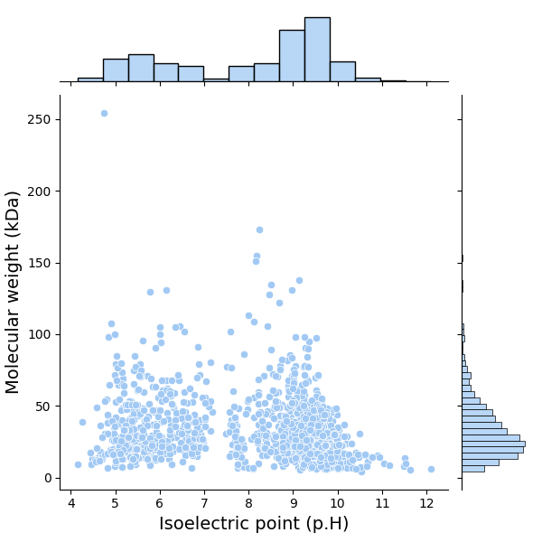
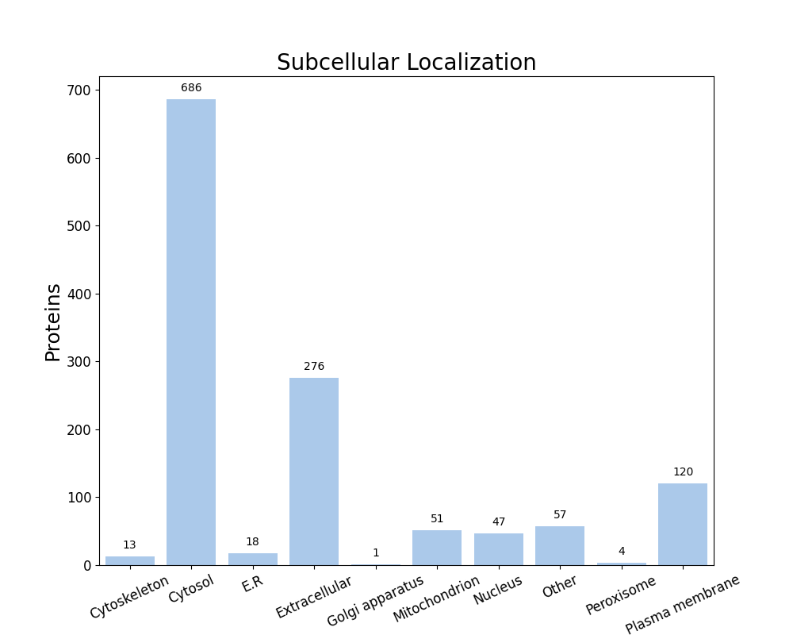

FastProtein Software 1.0
========================
##### Protein Information Software

---
### Summary
| Information                          | Value              |
| ------------------------------------ | ------------------ |
| Processed proteins                   | 1273               |
| Molecular mass (kda) mean            | 33.74 &#177; 22.05 |
| Isoelectric point mean               | 8.02 &#177; 1.77   |
| Hydrophicity mean                    | -0.23 &#177; 0.43  |
| Aromaticity mean                     | 0.11 &#177; 0.04   |
| Proteins with TM                     | 296                |
| Proteins with SP                     | 242                |
| Proteins with GPI                    | 5                  |
| Membrane proteins                    | 300                |
| Proteins with E.R Retention domains  | 168                |
| Proteins with NGlycosylation domains | 996                |
### Molecular mass (kDa) vs Isoelectric point (pH)

---
### Subcellular localization (by WolfPSort) - Organism: animal

| Subcellular localization | Proteins |
| ------------------------ | -------- |
| Cytosol                  | 686      |
| Extracellular            | 276      |
| Plasma membrane          | 120      |
| Other                    | 57       |
| Mitochondrion            | 51       |
| Nucleus                  | 47       |
| E.R                      | 18       |
| Cytoskeleton             | 13       |
| Peroxisome               | 4        |
| Golgi apparatus          | 1        |
---
### E.R Retention domain summary
| Domain | Quantity |
| ------ | -------- |
| KEEL   | 31       |
| KDEL   | 12       |
| SQEL   | 10       |
| SNEL   | 22       |
| AEEL   | 15       |
| KNEL   | 34       |
| ANEL   | 7        |
| HNEL   | 11       |
| REEL   | 8        |
| QEEL   | 10       |
Only top 10

---
### NGlyc domain summary
| Domain | Quantity |
| ------ | -------- |
| NNS    | 123      |
| NLS    | 236      |
| NKT    | 122      |
| NKS    | 150      |
| NLT    | 104      |
| NIT    | 125      |
| NIS    | 227      |
| NFS    | 147      |
| NVS    | 105      |
| NSS    | 157      |
Only top 10

---
| Id     | Length |  kDa   | Isoelectric_Point | Hydropathy | Aromaticity | Localization  | TMHMM_2 | Phobius_TM | PredGPI | Membrane_evidences | Membrane_evidences_detail |  SignalP5   | Phobius_SP | ER_Retention_Total | NGlyc_Total |          ER_Retention_Domains           |                                       NGlyc_Domains                                       |                          Header                          | Local_alignment_description | Gene_Ontology | Interpro_Annotation | PFAM_Annotation | Panther_Annotation |
| ------ |:------:|:------:|:-----------------:|:----------:|:-----------:|:-------------:|:-------:|:----------:|:-------:|:------------------:|:-------------------------:|:-----------:|:----------:|:------------------:|:-----------:|:---------------------------------------:|:-----------------------------------------------------------------------------------------:|:--------------------------------------------------------:| --------------------------- | ------------- | ------------------- | --------------- | ------------------ |
| O51076 |  122   | 14.14  |       9.02        |   -1.02    |    0.13     |    Cytosol    |    0    |     0      |    -    |         0          |                           |      -      |     -      |         0          |      0      |                                         |                                                                                           |       Transcriptional/translational repressor BpuR       | -                           |               |                     |                 |                    |
| O51312 |  433   | 47.29  |       5.38        |   -0.21    |    0.07     |    Cytosol    |    0    |     0      |    -    |         0          |                           |      -      |     -      |         0          |      1      |                                         |                                       NTS[321-324]                                        |                         Enolase                          | -                           |               |                     |                 |                    |
| P70826 |  555   | 62.44  |       6.17        |   -0.18    |    0.10     |    Cytosol    |    0    |     0      |    -    |         0          |                           |      -      |     -      |         0          |      3      |                                         |                             NTS[1-4];NIS[26-29];NVS[387-390]                              | Pyrophosphate--fructose 6-phosphate 1-phosphotransferase | -                           |               |                     |                 |                    |
| Q07337 |  210   | 22.34  |       8.35        |   -0.40    |    0.02     | Extracellular |    0    |     0      |    -    |         0          |                           | SP(Sec/SPI) |     Y      |         1          |      5      |              AEEL[169-173]              |                 NNS[19-22];NTS[26-29];NLT[40-43];NGS[93-96];NGT[162-165]                  |                 Outer surface protein C                  | -                           |               |                     |                 |                    |
| O51125 |  780   | 89.05  |       8.51        |   -0.19    |    0.09     |    Cytosol    |    0    |     0      |    -    |         0          |                           |      -      |     -      |         0          |      5      |                                         |             NLS[257-260];NIS[396-399];NAS[463-466];NVS[666-669];NFS[690-693]              |                    Endonuclease MutS2                    | -                           |               |                     |                 |                    |
| O51173 |  665   | 74.72  |       5.42        |   -0.48    |    0.07     |    Cytosol    |    0    |     0      |    -    |         0          |                           |      -      |     -      |         0          |      7      |                                         |  NSS[77-80];NET[94-97];NLS[213-216];NQS[220-223];NIS[333-336];NVT[415-418];NFS[523-526]   |           Flagellar hook-associated protein 2            | -                           |               |                     |                 |                    |
| O51263 |  201   | 23.14  |       9.55        |   -0.41    |    0.10     |    Nucleus    |    0    |     0      |    -    |         0          |                           |      -      |     -      |         0          |      1      |                                         |                                       NIS[121-124]                                        |                 dITP/XTP pyrophosphatase                 | -                           |               |                     |                 |                    |
| O51396 |  810   | 91.38  |       6.85        |   -0.22    |    0.07     |    Cytosol    |    0    |     0      |    -    |         0          |                           |      -      |     -      |         0          |      6      |                                         |       NGS[170-173];NAS[203-206];NKS[269-272];NIS[586-589];NMS[725-728];NDS[798-801]       |                   DNA gyrase subunit A                   | -                           |               |                     |                 |                    |
| O51418 |   99   | 11.02  |       5.42        |   -0.18    |    0.06     |    Cytosol    |    0    |     0      |    -    |         0          |                           |      -      |     -      |         0          |      1      |                                         |                                        NMS[10-13]                                         |             Nucleoid-associated protein EbfC             | -                           |               |                     |                 |                    |
| O51522 |  533   | 59.40  |       8.21        |   -0.02    |    0.08     |  Peroxisome   |    1    |     0      |    -    |         1          |            TM             |      -      |     Y      |         0          |      3      |                                         |                           NIT[89-92];NIS[170-173];NES[339-342]                            |                       CTP synthase                       | -                           |               |                     |                 |                    |
| O51578 |  1169  | 137.83 |       9.13        |   -0.51    |    0.10     |    Cytosol    |    0    |     0      |    -    |         0          |                           |      -      |     -      |         1          |      7      |              KEEL[196-200]              | NNT[9-12];NYS[111-114];NKT[556-559];NIT[652-655];NES[732-735];NTT[755-758];NIT[1078-1081] |                RecBCD enzyme subunit RecB                | -                           |               |                     |                 |                    |
| O51752 |  390   | 44.14  |       9.60        |   -0.12    |    0.08     |    Cytosol    |    1    |     0      |    -    |         1          |            TM             |      -      |     -      |         1          |      2      |              ANEL[348-352]              |                                  NAT[40-43];NTS[207-210]                                  |    Coenzyme A biosynthesis bifunctional protein CoaBC    | -                           |               |                     |                 |                    |
| O51767 |  823   | 95.09  |       9.35        |   -0.32    |    0.09     |    Cytosol    |    0    |     0      |    -    |         0          |                           |      -      |     -      |         3          |      2      | KDEL[11-15];KNEL[407-411];KNEL[676-680] |                                 NTS[194-197];NIT[698-701]                                 |             ATP-dependent RNA helicase HrpA              | -                           |               |                     |                 |                    |
| P0CL64 |  511   | 58.06  |       8.22        |   -0.13    |    0.09     |    Cytosol    |    0    |     0      |    -    |         0          |                           |      -      |     -      |         0          |      4      |                                         |                     NIS[45-48];NET[157-160];NWS[194-197];NIS[286-289]                     |           GMP synthase [glutamine-hydrolyzing]           | -                           |               |                     |                 |                    |
| P0CL66 |  273   | 29.37  |       8.77        |   -0.50    |    0.03     | Extracellular |    0    |     0      |    -    |         0          |                           | SP(Sec/SPI) |     Y      |         0          |      5      |                                         |               NVS[19-22];NGS[70-73];NIS[189-192];NDT[201-204];NGT[250-253]                |                 Outer surface protein A                  | -                           |               |                     |                 |                    |
| P46795 |  335   | 36.25  |       7.74        |   -0.08    |    0.05     |    Cytosol    |    0    |     0      |    -    |         0          |                           |      -      |     -      |         0          |      2      |                                         |                                 NAS[149-152];NGT[228-231]                                 |         Glyceraldehyde-3-phosphate dehydrogenase         | -                           |               |                     |                 |                    |
| P49058 |  404   | 43.77  |       8.51        |   -0.14    |    0.05     |    Cytosol    |    0    |     0      |    -    |         0          |                           |      -      |     -      |         0          |      3      |                                         |                            NIS[37-40];NMS[73-76];NNT[252-255]                             |          Inosine-5'-monophosphate dehydrogenase          | -                           |               |                     |                 |                    |
| Q45032 |  660   | 77.55  |       9.24        |   -0.39    |    0.12     |    Cytosol    |    0    |     0      |    -    |         0          |                           |      -      |     -      |         0          |      4      |                                         |                     NGS[41-44];NQT[115-118];NCS[380-383];NKT[635-638]                     |             Replication restart protein PriA             | -                           |               |                     |                 |                    |
| Q59190 |  206   | 23.87  |       6.98        |   -0.29    |    0.12     |    Cytosol    |    0    |     0      |    -    |         0          |                           |      -      |     -      |         0          |      1      |                                         |                                       NTT[156-159]                                        |                      Uridine kinase                      | -                           |               |                     |                 |                    |
| O07497 |  899   | 102.09 |       7.59        |   -0.45    |    0.08     |    Cytosol    |    0    |     0      |    -    |         0          |                           |      -      |     -      |         1          |      6      |               KDEL[50-54]               |       NKT[372-375];NHS[486-489];NVS[533-536];NIS[729-732];NSS[834-837];NKS[862-865]       |             Protein translocase subunit SecA             | -                           |               |                     |                 |                    |
| O30563 |  203   | 23.52  |       6.05        |   -0.37    |    0.12     |    Cytosol    |    0    |     0      |    -    |         0          |                           |      -      |     -      |         0          |      1      |                                         |                                        NHT[79-82]                                         |                Superoxide dismutase [Fe]                 | -                           |               |                     |                 |                    |
| O30564 |  268   | 30.36  |       8.44        |   -0.39    |    0.09     |    Cytosol    |    0    |     0      |    -    |         0          |                           |      -      |     -      |         0          |      2      |                                         |                                 NAS[109-112];NAT[241-244]                                 |            Glucosamine-6-phosphate deaminase             | -                           |               |                     |                 |                    |
| O50161 |  379   | 43.46  |       8.75        |   -0.26    |    0.09     |    Cytosol    |    0    |     0      |    -    |         0          |                           |      -      |     -      |         0          |      3      |                                         |                           NSS[12-15];NLS[211-214];NIS[240-243]                            |           Cyclic di-GMP phosphodiesterase PdeB           | -                           |               |                     |                 |                    |
| O50163 |  392   | 43.07  |       8.70        |   -0.28    |    0.07     |    Cytosol    |    0    |     0      |    -    |         0          |                           |      -      |     -      |         0          |      3      |                                         |                            NQT[7-10];NQS[104-107];NIS[200-203]                            |              S-adenosylmethionine synthase               | -                           |               |                     |                 |                    |
| O50917 |  191   | 21.21  |       8.92        |   -0.44    |    0.05     | Extracellular |    1    |     1      |    -    |         2          |    PHOBIUS_TM&#124;TM     | SP(Sec/SPI) |     -      |         0          |      2      |                                         |                                   NKT[5-8];NST[179-182]                                   |                Decorin-binding protein A                 | -                           |               |                     |                 |                    |
| O50965 |  265   | 31.28  |       8.33        |   -0.45    |    0.10     |    Cytosol    |    0    |     0      |    -    |         0          |                           |      -      |     -      |         0          |      1      |                                         |                                       NSS[113-116]                                        |          Flavin-dependent thymidylate synthase           | -                           |               |                     |                 |                    |
##### Only top 10 proteins

---

##### Do you have a question or tips? Please contact us! E-mail: renato.simoes@ifsc.edu.br
Generated time: Tue Apr 07 00:18:37 UTC 2026